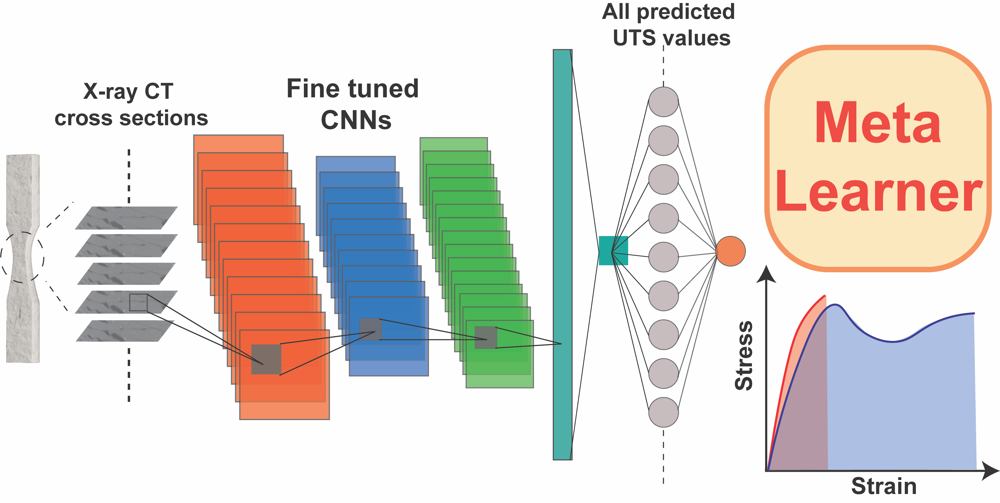

# Predict-Composite-Strength-by-CNN-Paper

This repository contains all code for the paper Predicting the Strength of Composites with Computer Vision Using Small Experimental Datasets. It includes scripts for data preprocessing, model training, and evaluation of predictive models designed to analyze composite material strength through computer vision techniques on limited datasets

### 1. Data

The dataset used in this project includes µ-CT images stored in Google Drive due to size limitations. You can access the data at the following link:

[Images Folder - µ-CT Dataset](https://drive.google.com/drive/folders/1-u20wZFzXZdZkEPIlHQq2MeBl_qfRyAa?usp=drive_link)

#### Folder Structure

- **Subfolders**: Each subfolder contains:
  - 100 images of a composite material sample.
  - One CSV file with each image's corresponding features, including calculated values relevant to morphology.

- **Subfolder Naming Convention**: Each subfolder name provides information about the composite and its mechanical properties. An example folder name follows this format:

  **Example**: `IPP_5%_4_0.44_1.403_0.245`

  - **Composite Name**: `IPP_5%_4`
  - **Mechanical Properties**:
    - `0.44`: Ultimate Tensile Strength (UTS) in MPa
    - `1.403`: Young's Modulus in GPa
    - `0.245`: Elongation at Break (%)

This dataset includes images for training, validation, and testing, using a cross-fold approach to maximize model robustness.

---

### 2. Composite_ML_classic_model.ipynb

This notebook demonstrates training classical machine learning models on features extracted from the µ-CT images. The results from this notebook correspond to Figures 2 and 3 in the paper, as well as Supplementary Figure S2. 

**Key Outputs**:
- Model performance metrics (R², MSE).
- Visualizations for predictions vs. true values of mechanical properties.

---

### 3. bayesopt_v5.py

This script performs Bayesian optimization on a ResNet18 model to fine-tune its parameters. The optimized model is saved as `resnet18-v5-finetune.zip`.

**Key Outputs**:
- Tuned ResNet18 model saved in a zip file.
- Optimal hyperparameters for improved performance on the composite dataset.

---

### 4. Composite_ML_CNN.ipynb

This notebook loads the fine-tuned ResNet18 model and evaluates its performance on predicting composite properties from the images. The results correspond to Figures 4, 5, 6, and 7 in the paper, as well as Supplementary Figures S4-S9.

**Key Outputs**:
- Model performance metrics (R², MSE).
- Figures showing model predictions, performance comparisons, and evaluation on test data.

---

### 5. samples.json

`samples.json` is a saved dictionary to ensure consistent sample loading across `Composite_ML_CNN.ipynb` and `Composite_ML_classic_model.ipynb`, matching the sample loading sequence used in the paper.
